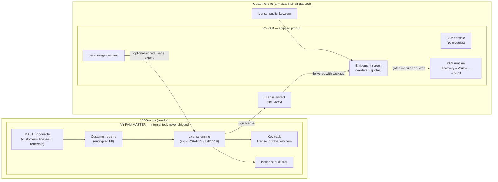
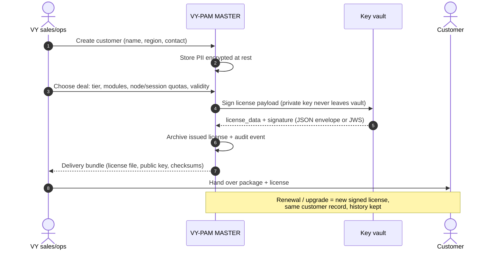
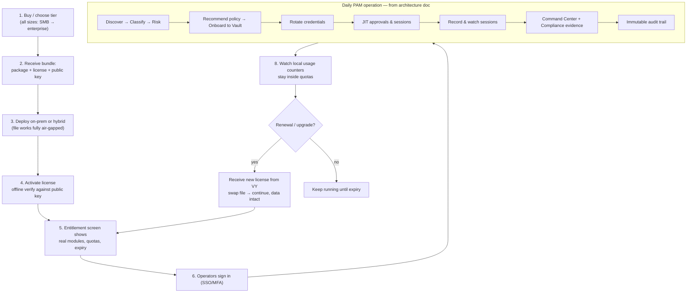
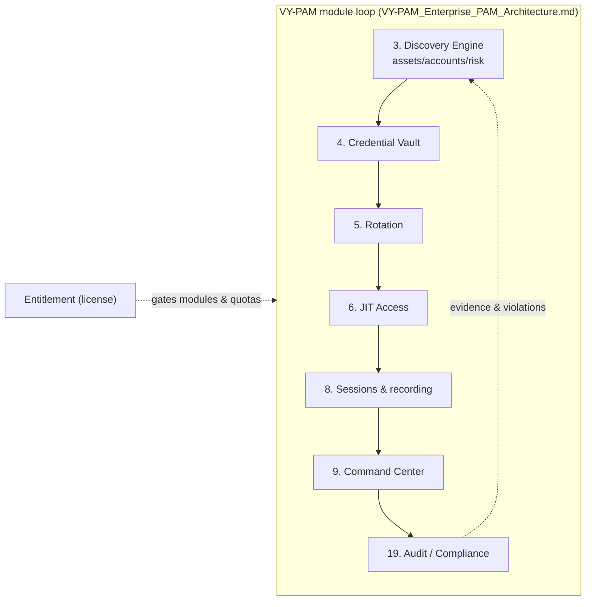

# VY-PAM MASTER + VY-PAM — Product Split, Plan & Workflows

> Companion to `VY-PAM_Enterprise_PAM_Architecture.md` (which remains the
> authoritative requirements for the **PAM product itself** — the "last goal").
> This document defines the **commercial split**: two tools, one platform.

---

## 1. The two products

| | **VY-PAM MASTER** (vendor tool) | **VY-PAM** (shipped product) |
|---|---|---|
| Runs at | VY-Groups only, never shipped | Customer site (on-prem / hybrid / air-gapped) |
| Purpose | Run the business: customers, deals, **license generation**, entitlement catalog, renewals | Operate PAM: discovery → vault → rotation → JIT → sessions → command → audit |
| Data | Customer registry, contacts, quotes, issued-license archive, usage archives (encrypted at rest) | That customer's own assets/accounts/sessions/audit only |
| Keys | **Holds `license_private_key.pem`** — custody never leaves it | Only `license_public_key.pem` for offline verification |
| Issues licenses? | ✅ Yes — its only way to create them | ❌ Never |
| Validates licenses? | Creates + signs | ✅ Offline verify of its own license |
| Audience | Sales / ops staff (internal) | Security & infra teams (customers of every size) |

**Rule of thumb:** if a screen shows *other customers* or *issues a license*,
it belongs to PAM-MASTER. If it shows *infrastructure being protected*, it
belongs to VY-PAM.

---

## 2. Architecture — components & artifacts



Deliverable bundle to a customer = **package + license file + public key +
docs**. Nothing else crosses the boundary.

---

## 3. Vendor workflow — you as the sales/ops side (PAM-MASTER)



---

## 4. Customer journey — you as the customer (VY-PAM)



**What the customer never sees:** license issuing, private keys, the customer
registry, or any other customer's data.

---

## 5. License activation & lifecycle (sequence)

```mermaid
sequenceDiagram
    autonumber
    actor Admin as Customer admin
    participant P as VY-PAM console
    participant V as PAM verify module
    participant F as license file (offline)

    Admin->>P: Import license file (or JWS)
    P->>V: verify(license_data, signature, public key)
    alt signature / expiry / tamper invalid
        V-->>P: reject + honest error
        P-->>Admin: entitlements locked, modules gated off
    else valid
        V-->>P: tiers, modules, quotas, expiry
        P-->>Admin: Entitlement screen: what you own, what is used
    end
    Note over P,F: Fully offline — no callback to VY required.<br/>Usage counters stay local; optional signed export for VY.
```

---

## 6. PAM internal operating workflow (the shipped product = architecture doc)



---

## 7. Phase-wise plan (resumable — checkpoints survive interruptions)

**Working decisions (confirmed):** PAM-MASTER starts as `pam_master/` in this
repo (own app, own API spec, own tests), designed to extract into its own
repo later. Docker is **development-only** (local DB/test environments); the
shipped product installs directly on customer systems — no VM or Docker
required. `backend/ipam_licensing` stays the shared crypto engine (MASTER
signs with it, PAM verifies with it).

> **RESUME RULE:** after any interruption, read the checkpoint below, verify
> it with the listed command, and continue from the first ☐. Never redo a ✅
> phase; re-run its verification instead.

### Phase 1 — Discovery Engine (module 3 of the architecture doc)
- ☑ **1a** Backend: models (`discovered_assets/accounts/scans/events`), rules
  v1 (`BASE_RISK`, `RECOMMENDED_POLICY`, secret-type map, account taxonomy)
  in `backend/phase2_license_server/models.py`
- ☑ **1b** Service: real TCP-connect scanner + banner grab, classify, scope
  caps (256 hosts/24 ports, single-flight), onboard/adopt/patch/stats/lists,
  discovery events merged into `/api/v1/events` — `service.py`
- ☑ **1c** Routes + `apis/openapi.yaml` (8 operations, schemas, events enum,
  admin security) + contract test ADMIN_OPERATIONS — **verify:** `python -m pytest
  backend/phase2_license_server/tests/test_openapi_contract.py -q`
- ☑ **1d** Tests `tests/test_discovery.py` (19, incl. real listener scan) —
  **verify:** `python -m pytest backend -q` → 206 passed
- ☑ **1e** Live smoke (recreated) — **verify:** `python
  %LOCALAPPDATA%\Temp\opencode\smoke_restructure.py` → 17/17
- ☑ **1f** Plan doc `VY-PAM_MASTER_and_PAM_Workflow.md` (this file) +
  phase/checkpoint structure
- ☑ **1g** Wire screen `frontend/screens/target_infrastructure_connectors/`:
  honest static purge (tiles/pills/tabs/rows/probe-stream/mesh/discovery-panel)
  + real JS wiring (stats, assets, filters, search, pagination, scan modal,
  onboard modal, adopt/ignore, event feed) + honest toasts — plus suite-wide
  shared-chrome purge (sidebar ZSP card ×11, top header ×12: breadcrumb /
  attestation / audit-rate / notifications / identity, local logo asset ×11)
- ☑ **1h** Verify screen: `node --check` scripts, fake-data sweep HTTP +
  `file://` in `shots_tool/__verify_discovery.mjs` (58 checks: register,
  real scan, ignore/restore, adopt, probe, filters, feed) +
  `shots_tool/__verify_live.mjs` (28 checks across 4 API screens),
  screenshots recaptured via `shots_tool/__shots.mjs`, launcher badge → LIVE —
  **verify:** `python -m pytest backend -q` → 206 + smoke 17/17 + both node
  verifiers ALL CHECKS PASSED
- ☐ **1i** Commit + push (ephemeral token, verify not persisted)

### Phase 2 — VY-PAM MASTER (vendor tool, `pam_master/`)
- ☐ **2a** Skeleton: own Flask app + config (private key custody lives ONLY
  here), own test fixtures, dev Docker compose (dev-only)
- ☐ **2b** Customer registry: records with PII encrypted at rest, list/create/
  edit, issuance history
- ☐ **2c** License generation: tier/modules/quotas/validity form → sign via
  `backend/ipam_licensing` → archive + audit trail + delivery bundle export
  (license file + public key + checksums); renewal/replace flow
- ☐ **2d** Own `openapi.yaml` + contract tests; anti-mixing tests (no PAM
  runtime imports; private key absent from shipped surface)
- ☐ **2e** Docs + screenshots + commit/push — **verify:** pam_master test suite green

### Phase 3 — Decouple the shipped PAM surface
- ☐ **3a** PAM keeps only `meta / validate / check / file / entitlement /
  local usage enforcement / settings / console APIs`; issuing, revoke/restore
  and customer data move to PAM-MASTER (revoke stays as server-side
  revocation-list authority for offline validation)
- ☐ **3b** Re-scope `apis/openapi.yaml` + move/rewrite tests; contract test
  both directions still green — **verify:** pytest + smoke
- ☐ **3c** Docs/screens/launcher reflect the split; commit/push

### Phase 4 — Continue `VY-PAM_Enterprise_PAM_Architecture.md` (the last goal)
- ☐ **4a** Rotation (5) → ☐ **4b** JIT (6) → ☐ **4c** Sessions (8) →
  ☐ **4d** Command Center hardening (9) → ☐ **4e** Audit (19) → …
  module order per the architecture doc; each module = model + endpoints +
  openapi + tests + honest screen wiring, then commit/push.

### Checkpoint log (update at every phase boundary)
| Date | Stopped after | Resume from |
|---|---|---|
| 2026-10-06 | 1a–1f ✅ (206 tests, 17/17 smoke, plan doc) | **1g** (screen wiring) |
| 2026-10-06 | 1a–1h ✅ (206 tests, 17/17 smoke, 58+58 UI checks, 12 screenshots, launcher LIVE) | **1i** (commit + push) |

---

## 8. Commercial fit — all customer types

- **SMB:** file license, defaults on, single site — same product, fewer nodes.
- **Enterprise:** quotas per node/session, SSO/HSM, multi-site.
- **Air-gapped / regulated:** everything offline by design (file license, no
  phone-home; optional signed usage export transferred manually).
- **Upgrades:** new signed license, same artifact format — no reinstall.
