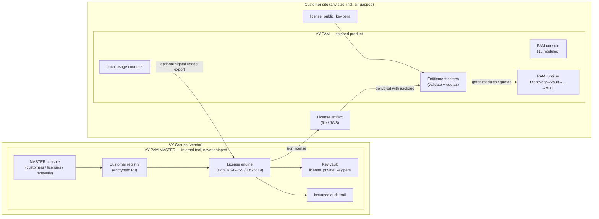
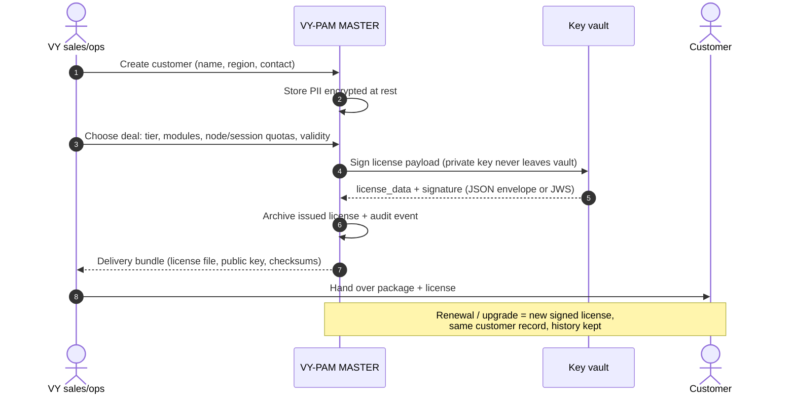
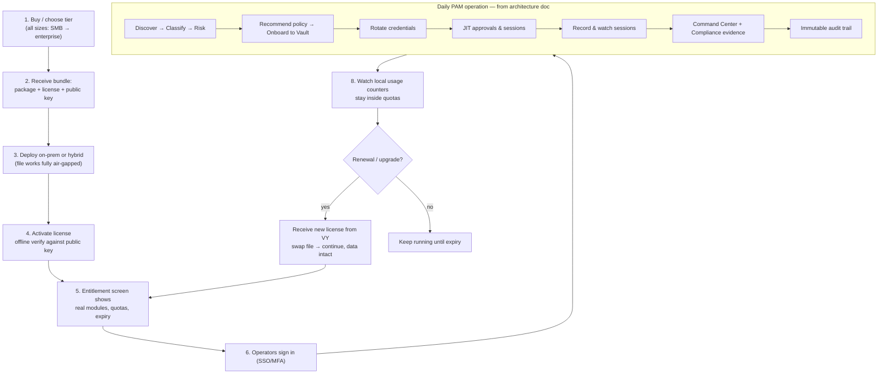
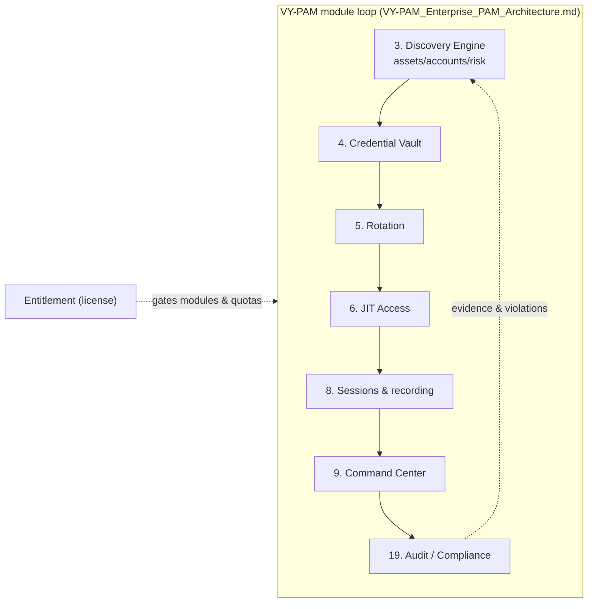

# VY-PAM MASTER + VY-PAM — Product Split, Plan & Workflows

> Companion to `VY-PAM_Enterprise_PAM_Architecture.md` (which remains the
> authoritative requirements for the **PAM product itself** — the "last goal").
> This document defines the **commercial split**: two tools, one platform.

---

## 1. The two products

| | **VY-PAM MASTER** (vendor tool) | **VY-PAM** (shipped product) |
|---|---|---|
| Runs at | VY-Groups only, never shipped | Customer site (on-prem / hybrid / air-gapped) |
| Purpose | Run the business: customers, deals, **license generation**, entitlement catalog, renewals | Operate PAM: discovery → vault → rotation → JIT → sessions → command → audit |
| Data | Customer registry, contacts, quotes, issued-license archive, usage archives (encrypted at rest) | That customer's own assets/accounts/sessions/audit only |
| Keys | **Holds `license_private_key.pem`** — custody never leaves it | Only `license_public_key.pem` for offline verification |
| Issues licenses? | ✅ Yes — its only way to create them | ❌ Never |
| Validates licenses? | Creates + signs | ✅ Offline verify of its own license |
| Audience | Sales / ops staff (internal) | Security & infra teams (customers of every size) |

**Rule of thumb:** if a screen shows *other customers* or *issues a license*,
it belongs to PAM-MASTER. If it shows *infrastructure being protected*, it
belongs to VY-PAM.

---

## 2. Architecture — components & artifacts



Deliverable bundle to a customer = **package + license file + public key +
docs**. Nothing else crosses the boundary.

---

## 3. Vendor workflow — you as the sales/ops side (PAM-MASTER)



---

## 4. Customer journey — you as the customer (VY-PAM)



**What the customer never sees:** license issuing, private keys, the customer
registry, or any other customer's data.

---

## 5. License activation & lifecycle (sequence)

```mermaid
sequenceDiagram
    autonumber
    actor Admin as Customer admin
    participant P as VY-PAM console
    participant V as PAM verify module
    participant F as license file (offline)

    Admin->>P: Import license file (or JWS)
    P->>V: verify(license_data, signature, public key)
    alt signature / expiry / tamper invalid
        V-->>P: reject + honest error
        P-->>Admin: entitlements locked, modules gated off
    else valid
        V-->>P: tiers, modules, quotas, expiry
        P-->>Admin: Entitlement screen: what you own, what is used
    end
    Note over P,F: Fully offline — no callback to VY required.<br/>Usage counters stay local; optional signed export for VY.
```

---

## 6. PAM internal operating workflow (the shipped product = architecture doc)



---

## 7. Phase-wise plan (resumable — checkpoints survive interruptions)

**Working decisions (confirmed):** PAM-MASTER starts as `pam_master/` in this
repo (own app, own API spec, own tests), designed to extract into its own
repo later. Docker is **development-only** (local DB/test environments); the
shipped product installs directly on customer systems — no VM or Docker
required. `backend/ipam_licensing` stays the shared crypto engine (MASTER
signs with it, PAM verifies with it).

> **RESUME RULE:** after any interruption, read the checkpoint below, verify
> it with the listed command, and continue from the first ☐. Never redo a ✅
> phase; re-run its verification instead.

### Phase 1 — Discovery Engine (module 3 of the architecture doc)
- ☑ **1a** Backend: models (`discovered_assets/accounts/scans/events`), rules
  v1 (`BASE_RISK`, `RECOMMENDED_POLICY`, secret-type map, account taxonomy)
  in `backend/phase2_license_server/models.py`
- ☑ **1b** Service: real TCP-connect scanner + banner grab, classify, scope
  caps (256 hosts/24 ports, single-flight), onboard/adopt/patch/stats/lists,
  discovery events merged into `/api/v1/events` — `service.py`
- ☑ **1c** Routes + `apis/openapi.yaml` (8 operations, schemas, events enum,
  admin security) + contract test ADMIN_OPERATIONS — **verify:** `python -m pytest
  backend/phase2_license_server/tests/test_openapi_contract.py -q`
- ☑ **1d** Tests `tests/test_discovery.py` (19, incl. real listener scan) —
  **verify:** `python -m pytest backend -q` → 206 passed
- ☑ **1e** Live smoke (recreated) — **verify:** `python
  %LOCALAPPDATA%\Temp\opencode\smoke_restructure.py` → 17/17
- ☑ **1f** Plan doc `VY-PAM_MASTER_and_PAM_Workflow.md` (this file) +
  phase/checkpoint structure
- ☑ **1g** Wire screen `frontend/screens/target_infrastructure_connectors/`:
  honest static purge (tiles/pills/tabs/rows/probe-stream/mesh/discovery-panel)
  + real JS wiring (stats, assets, filters, search, pagination, scan modal,
  onboard modal, adopt/ignore, event feed) + honest toasts — plus suite-wide
  shared-chrome purge (sidebar ZSP card ×11, top header ×12: breadcrumb /
  attestation / audit-rate / notifications / identity, local logo asset ×11)
- ☑ **1h** Verify screen: `node --check` scripts, fake-data sweep HTTP +
  `file://` in `shots_tool/__verify_discovery.mjs` (58 checks: register,
  real scan, ignore/restore, adopt, probe, filters, feed) +
  `shots_tool/__verify_live.mjs` (28 checks across 4 API screens),
  screenshots recaptured via `shots_tool/__shots.mjs`, launcher badge → LIVE —
  **verify:** `python -m pytest backend -q` → 206 + smoke 17/17 + both node
  verifiers ALL CHECKS PASSED
- ☑ **1i** Commit + push (ephemeral token, verify not persisted) — `9f83bd3`
  pushed to `main`; no `ghp_` in git config, worktree, or history

### Phase 2 — VY-PAM MASTER (vendor tool, `pam_master/`)
- ☑ **2a** Skeleton: own Flask app + config (private key custody lives ONLY
  here), own test fixtures, dev Docker compose (dev-only) — **done:**
  `pam_master/` package (config, custody keys, licensing bridge, health,
  keygen CLI), 13-test suite (temp keys/db only), Dockerfile + compose,
  README with custody rules; live boot smoke honest (`rsa_key: present`,
  `ed25519_key: missing`, `ready: false` = this machine's real state)
  — **verify:** `python -m pytest pam_master -q` → 13 passed
- ☑ **2b** Customer registry: records with PII encrypted at rest, list/create/
  edit, issuance history — **done:** `registry.py` CRUD + validation,
  `crypto.py` AES-256-GCM bound to row `public_id`, `db.py` schema
  (customers + issuance_history), registry key custody (file/b64 env, honest
  503 without it), history write helper for 2c; README API table
  — **verify:** `python -m pytest pam_master -q` → 28 passed
- ☑ **2c** License generation: tier/modules/quotas/validity form → sign via
  `backend/ipam_licensing` → archive + audit trail + delivery bundle export
  (license file + public key + checksums); renewal/replace flow — **done:**
  `issuance.py` (options/issue/renew/list/get/bundle/audit), claims +
  signature via shared engine, encrypted archive (AAD = license_id),
  atomic license+history+audit write, renewal supersedes in-transaction,
  bundle verifies offline (SHA256SUMS + public key inside), shared
  `errors.py` failure types (400/404/409/500/503)
  — **verify:** `python -m pytest pam_master -q` → 40 passed
- ☑ **2d** Own `openapi.yaml` + contract tests; anti-mixing tests (no PAM
  runtime imports; private key absent from shipped surface) — **done:**
  `pam_master/openapi.yaml` (14 operations, strict request bodies, honest
  error-type enum, all response schemas), `tests/test_openapi_contract.py`
  (both-direction path coverage, live-shape checks, enums/ranges mirrored
  against code constants, git-tracked-file private-key scan), anti-mixing
  scan extended (`phase2_license_server` + `from backend.` / `import backend`)
  — **verify:** `python -m pytest pam_master -q` → 46 passed
- ☑ **2e** Docs + screenshots + commit/push — **done:** root README documents
  the two-product split (intro, tree entry, quick-start, custody bullet,
  test counts corrected to 206/46); `pam_master/README.md` complete
  (endpoints, custody rules, API contract). Screenshots: **none apply** —
  the MASTER is API-only, no UI exists in Phase 2 (console/screens
  screenshots return with the shipped side in 3c)
  — **verify (phase boundary):** `pytest backend` 206 + `pytest pam_master`
  46 + smoke 17/17 + both shots verifiers `ALL CHECKS PASSED`

### Phase 3 — Decouple the shipped PAM surface
- ☑ **3a** Self-issue removed from the shipped server: `POST /api/v1/licenses`
  is gone — the server only **verifies and records**, through the new
  `POST /api/v1/licenses/import` (admin token; 400 for malformed / foreign-key
  signed / expired / structurally invalid claims — the old issuing-form rules
  ported to claim-shape checks, claims stored byte-for-byte as signed, never
  normalised; 409 `Conflict` for an already-installed file). `service.issue_license`
  + its `_coerce_*` form helpers deleted, so **no shipped-server code touches a
  private key anymore**. Per decisions: revoke/restore + list/detail **stay** on
  PAM (local revocation-list authority for offline validation + the console's
  entitlement view); issuing/customer lookup live only in PAM-MASTER (2c).
  New `imported` event type (replaces `issued` in event assertions). Tests play
  the vendor: helpers sign with the shared engine then import.
- ☑ **3b** Re-scope `apis/openapi.yaml` + contract + tests — executed in
  lockstep with 3a (the two-directional contract test forbids an unserved
  documented route and an undocumented served one, so route removal, spec and
  test rewrites land together): POST `/licenses` → POST `/licenses/import`,
  `IssueLicenseRequest/Response` → `LicenseEnvelope` request +
  `ImportLicenseResponse`, new `Conflict` response, algorithm enums corrected
  to the real casing (`RSA-PSS-SHA256`/`Ed25519`), `ADMIN_OPERATIONS` updated;
  old form-validation tests rewritten as import rejection tests (+409, expired,
  foreign-signature, unusable-file cases), smoke reworked to sign vendor-side
  and import — **verify (phase boundary):** pytest backend **216** +
  pytest pam_master 46 + smoke 17/17 + both shots verifiers `ALL CHECKS PASSED`
- ☑ **3c** Docs/screens/launcher reflect the split — console rework: the
  `Renew / Upgrade Tier` issue form became `Import Vendor License` (file or
  paste → `POST /licenses/import`, signature verified, claims recorded as
  signed, re-download; `issue*` ids/JS renamed to `import*`); all issuing copy
  → import copy (subtitle, empty states, token note, account note, badge);
  launcher lines fixed; phase-2 server README re-scoped (intro, endpoint row,
  `### Issue` curl section → `### Import`, config notes, audit bullet, test
  counts 134/216); `apis/README` error list +409; frontend README checked —
  already accurate; license `screen.png` recaptured; stale :5000 dev server
  restarted on current code (`POST /licenses` → 405, `/licenses/import` → 400
  on empty body, discovery still honest); live UI check: modal opens, server
  refuses a malformed payload, dev registry untouched, no page errors —
  **verify (phase boundary):** pytest backend **216** + pytest pam_master
  **46** + smoke 17/17 + both shots verifiers `ALL CHECKS PASSED`

### Phase 4 — Continue `VY-PAM_Enterprise_PAM_Architecture.md` (the last goal)
- ☑ **4a** Rotation (5) → ☑ **4b** JIT (6) → ☑ **4c** Sessions (8) →
  ☑ **4d** Command Center hardening (9) → ☑ **4e** Audit (19) →
  ☑ **4f** Risk-Based Access Engine (7): `risk_events` scores every request
  over the eight components the doc names (user/device/asset/time/location/
  behavior/ticket/command — each read from a measured input: inventory
  lookup, live command policy, local clock, `ipaddress`, subject history,
  ITSM ticket shape), bands 0–25/26–50/51–75/76–100 drive
  allow/mfa/approval/block; `POST /risk/evaluate` + list + stats, joins the
  §19 ledger as the 8th source, session start is gated (HIGH needs an
  active JIT grant, CRITICAL is refused — 403 carries the breakdown), policy
  screen gains a Risk section → ☑ **4g** PAM bypass detection (§10) →
  ☑ **4h** Break Glass (§17) → …
  module order per the architecture doc; each module = model + endpoints +
  openapi + tests + honest screen wiring, then commit/push.

### Checkpoint log (update at every phase boundary)
| Date | Stopped after | Resume from |
|---|---|---|
| 2026-10-06 | 1a–1f ✅ (206 tests, 17/17 smoke, plan doc) | **1g** (screen wiring) |
| 2026-10-06 | 1a–1h ✅ (206 tests, 17/17 smoke, 58+58 UI checks, 12 screenshots, launcher LIVE) | **1i** (commit + push) |
| 2026-10-06 | **Phase 1 complete ✅** (`9f83bd3` pushed: Discovery module + honest screen + chrome purge + shots_tool) | **Phase 2 / 2a** (`pam_master/` skeleton) |
| 2026-10-07 | **Phase 2a ✅** (`pam_master/` skeleton: 13 tests, live smoke honest; regression 206 + 17/17) | **2b** (customer registry, PII encrypted at rest) |
| 2026-10-07 | **Phase 2b ✅** (registry CRUD + PII AES-256-GCM at rest; 28 tests; live smoke: 201/list/PATCH/history + no plaintext in DB file) | **2c** (license generation + delivery bundle) |
| 2026-10-07 | **Phase 2c ✅** (issuance: signed claims, encrypted archive, renewal supersedes, offline-verifiable bundle, audit; 40 tests; live smoke: exact 90d/365d spans, sha256 match, tables 0→4) | **2d** (own `openapi.yaml` + contract/anti-mixing tests) |
| 2026-10-07 | **Phase 2d ✅** (own `openapi.yaml` + contract both ways + live shapes + enum mirrors + tracked-key scan + extended anti-mixing; 46 tests) | **2e** (docs + phase close + commit/push) |
| 2026-10-07 | **Phase 2 complete ✅** (PAM-MASTER vendor tool: key custody, PII-encrypted registry, signed issuance/renewal/bundle/audit, own contract — 46 tests; root README split docs; full boundary regression green) | **Phase 3** (decouple shipped PAM surface — **3a**) |
| 2026-10-07 | **Phase 3a+3b ✅** (self-issue removed → vendor-signed `POST /licenses/import`; form rules → claim-shape checks; no server code signs anymore; openapi/contract/tests/smoke lockstep; backend 216, pam_master 46, smoke 17/17, verifiers green) | **3c** (docs/screens/launcher reflect the split) |
| 2026-10-07 | **Phase 3 complete ✅** (console ISSUE → vendor-import flow; launcher + phase-2/apis docs honest; screen recaptured; dev server restarted on current code; backend **216**, pam_master **46**, smoke 17/17, verifiers green, live UI check: modal/error path + registry untouched) | **Phase 4 / 4a** (Rotation (5)) |
| 2026-10-07 | **Phase 4a ✅** (real encrypted secrets: AES-256-GCM at rest, AAD-bound, `vault_secret_versions` history, admin reveal, per-type generation; rotation pipeline in architecture order mint+seal → same-target dependents → decrypt round-trip validation → audit, triggers manual/bulk/session-end/scheduler, failed→retry, 503 key custody; openapi + contract + 30 new tests lockstep; vault screen reveal/copy/bulk/onboard wired honestly, screen recaptured; backend **246**, pam_master **46**, smoke 17/17, both verifiers `ALL CHECKS PASSED`, live UI 8/8) | **4b** (JIT (6)) |
| 2026-10-07 | **Phase 4b ✅** (JIT/JEA: `jit_requests`+`jit_events`, deterministic risk over tier/duration/off-hours/24h-repeat/ticket-shape/credential-health with visible factor points, bands low auto → medium manager → high +security → critical blocked, self-approval 403, grant = real checkout `session_ref=jit-<id>` with `expires_at`, expiry lazy on read + scheduler tick releases and rotates `trigger=session_end`; 8 endpoints + openapi/contract/ADMIN_OPERATIONS lockstep + 18 tests; JIT screen fully live — queue tabs, real stat cards, request modal, approve/deny/issue/close via API, detail pane (risk factors, quorum stepper, live state check) rebuilt from responses, fabricated footer/design values purged, verify_live sweeps 5 screens, screen recaptured; backend **264**, pam_master **46**, smoke 17/17, both verifiers `ALL CHECKS PASSED`, JIT live UI **49/49**) | **4c** (Sessions (8)) |
| 2026-10-07 | **Phase 4c ✅** (privileged sessions: `privileged_sessions` + append-only `session_events`, start against a vault credential (real checkout) or an active JIT grant (one live session per grant → 409), events carry `seq`/custody watermark/actor, controls gate for real — typed content while `record=false` → 403, gated channels store `allowed=false` + reason as kept evidence, `keystroke_log=false` stores null content + `withheld`; pause/lock refuse events (409) until resume, terminate/complete run the cascade — linked grant closes together, own checkout releases, credential rotates exactly once, lazy grant expiry ends sessions `grant_expired`; 12 endpoints + openapi (**49 paths**)/contract/ADMIN_OPERATIONS lockstep + 23 tests; session hub screen fully live — Start Session modal (13 protocols, credential select, control flags), real cards/tabs/stats, terminal replay with blocked boxes + withheld rows, Control Violations panel, governance (access source/quorum/flags), kill modal shows the real `sess-*` ref, archived filter; verify_live sweeps 6 screens with the 4c design-value FORBIDDEN set, screen recaptured 1920×1600; fixed a time-of-day-dependent ipam expiry test (fixed clock); backend **287**, pam_master **46**, smoke 17/17, both verifiers `ALL CHECKS PASSED`, session live UI **65/65**) | **4d** (Command Center hardening (9)) |
| 2026-10-07 | **Phase 4d ✅** (command control (9): `command_rules` + `command_incidents`, `session_events` gains `decision`/`rule_id`/`ref_seq`, default-allow engine — case-insensitive substring match + case-insensitive fnmatch target glob, evaluation order block → approval → allow (scoped first, longest pattern, lowest id), shipped §9 policy seeds 15 rules once into an empty table so a deletion sticks, held commands resolve append-only (`type=approval` rows referencing `ref_seq`, hold never edited), a scoped block with `terminate_on_match` ends the session through the release-and-rotate cascade and preserves the evidence as an `inc-<hex>` incident (close records who/when/note, second close 409); 12 endpoints / 10 path keys + openapi (**59 paths**)/contract/ADMIN_OPERATIONS (**36**) lockstep + 18 tests; policy screen fully live — header `POLICY: <n> rules · <engine_hash>`, real stat cards (enabled ratio, intercepts today, approvals, by-action split + sync provenance), 15 rule cards with create/edit/delete via modal, dry-run simulator (block/escalation/approval/default-allow verdicts naming the matched rule), approval queue resolve, incident lifecycle, sidebar ZSP chip follows live state, frozen design values purged; verify_live sweeps 7 screens with the 4d FORBIDDEN set, launcher cards honest (JIT/session-hub/policy now LIVE + header prose counts nine), screen recaptured 1920×1600; backend **305**, pam_master **46**, smoke 17/17, all verifiers `ALL CHECKS PASSED`, policy live UI **71/71**) | **4e** (Audit (19)) |
| 2026-10-08 | **Phase 4e ✅** (immutable audit ledger (19): `audit_events` hash chain — `seq`/`prev_hash`/`event_hash`, sha256 over the canonical record (genesis `0`×64), a SQLAlchemy `before_flush` listener fans all seven module trails in (license, settings, vault, discovery, JIT, session lifecycle, command — plus incident rows, explicit `incident-closed:` records, and reveals that log who/what/never the secret; channel content stays in the recording), SQLite triggers refuse `UPDATE`/`DELETE` (`audit_events is append-only (architecture 19)`), first boot backfills pre-existing history exactly once (idempotent), `/audit/verify` walks every record and reports the first break (sequence gap / content mismatch / re-link), `/audit/export` streams the chain as NDJSON; 3 endpoints / 3 path keys + openapi (**62 paths**)/contract/ADMIN_OPERATIONS (**36**) lockstep + 19 tests; overview `counters.total_events` now counts the ledger; compliance screen live — digest card (chain head SHA-256 + `seq` + depth, honest ISO-8601/hash-bound + append-only-SQLite rows, append-only badge), header button relabelled **Verify Hash Chain** and wired click-only to the real walk (records `Last Verify: 23/23 ok just now`), 7-source filter chips (click-to-fetch), probe rows carry `#seq` + truncated hash, CSV export rebuilt from the full ledger with chain columns, new NDJSON SIEM export button; verify_live 7 screens + discovery verifier `ALL CHECKS PASSED`, compliance live UI **36/36**, previews refreshed (compliance + policy recaptured 1920×1600); backend **324**, pam_master **46**, smoke 17/17; dev DB seeded only through the public API — **23** real records across all seven sources, chain verify 23/23 intact) | **4f** (next module per `VY-PAM_Enterprise_PAM_Architecture.md` — candidates: §7 risk engine, §10 bypass detection, §20 integrations) |
| 2026-10-08 | **Phase 4f ✅** (risk-based access engine (7): `risk_events` — the eight components the doc names, each with an honest detail and caps summing to exactly 100 (user ≤10 = 5 per prior critical in 24h, device ≤15 unknown to the discovered inventory, asset ≤30 `CRITICAL`25/`HIGH`20/`MEDIUM`10/`LOW`0 + 5 `unmanaged`, time ≤10 from the real local clock off-hours/weekend, location ≤5 when `ipaddress` says global — no geo feed claimed, behavior ≤15 = 10 blocked commands + 5 denied JITs in 24h, ticket ≤5 non-ITSM shape, command ≤10 `block`/≤5 `approval` via the live §9 engine); bands ≤25 allow / ≤50 mfa / ≤75 approval / else block; `POST /risk/evaluate` always advises and commits its row, the **session-start gate** in `POST /sessions` scores with `context=session_start` first (refusal kept as SOC evidence) then refuses critical outright / high without an active JIT grant → 403 + `details.risk`, `POST /sessions` response carries `risk` (+ optional `device` scored at start); 3 endpoints / 3 path keys + openapi (**65 paths**)/contract/ADMIN_OPERATIONS (**37**) lockstep + **19** tests; ledger joins the 8th source `risk` (`_map_risk_evaluation`: action = decision, ref `risk:<id>`, detail carries score/band/result/context/components), compliance filter chips 8→9 (8 sources incl. `risk`, labels + `speed` icon); policy screen gains the §7 section (4 stat tiles, score-on-click form → result + eight-component breakdown, spec band legend with caps, newest-first evaluations, enforcement note; file:// = dashes) wired by its own gated IIFE, compliance recaptured with the risk trail selected; test-fixture lesson recorded: history rows carry the bound real `datetime.now`, so the night-clock fixture must anchor **in the past** (Saturday 2026-09-26 15:00, weekend branch) for the 24h window to reach them; verify_live 7 screens + discovery verifier `ALL CHECKS PASSED`, risk live UI **43/43**; previews policy + compliance recaptured 1920×1600 no-fullPage; backend **343** (phase2 dir **261**), pam_master **46**, smoke 17/17; dev DB seeded only through the public API — **8** real evaluations across all four bands + 1 refused gate start (avg 50.6, refused 1), chain verify **35/35** intact across all eight sources) | **4g** (next module per `VY-PAM_Enterprise_PAM_Architecture.md` — candidates: §10 PAM Bypass Detection, §17 Break Glass, §20 Enterprise Integrations) |
| 2026-10-08 | **Docs deliverable set ✅** (docs/ ten documents: PRD, TRD, PAM flow, UI/UX brief, backend schema, API reference, security/compliance, deployment runbook, QA strategy, **IMPLEMENTATION_PLAN** — as-built truth plus pending-feature requirements, per-phase scope/dependencies/definition-of-done (4g §10 → 4h §17 → 4i §20 → 4j §11 → 4k §12 → 5a–5d §13–§16 → 6a–6c §18/RBAC/SSO-HSM) and the target end-state; round 1 pushed as 4acc59a) | **4g** (§10 PAM Bypass Detection per docs/IMPLEMENTATION_PLAN.md §3) |
| 2026-10-08 | **Phase 4g ✅** (PAM bypass detection (§10): `BypassSignal`/`BypassIncident`/`BypassEvent` — 19→**22** tables; ingest parses real bundles — OpenSSH `Accepted …` lines take the bundle's `target`, structured JSON records carry per-line `target`/`at`, every raw line kept verbatim as evidence, malformed/untargeted lines counted never invented, dedupe by origin+target+raw incl. in-batch; correlation touches only unscanned `observed` signals (target not managed → `out_of_scope`; a recorded session by the same actor on the same host covering `observed_at` → `covered`; else `candidate` + `byp-` incident whose ACTION block records `alert` (the ledger row), `rotation` (real §5 pipeline per vault item — `skipped` while checked out, `no_credential_on_file` when the vault has nothing, per-item failures caught so one broken credential never aborts the scan) and `block_source: not_connected`; re-scans never duplicate, an empty re-scan still records `scanned`; closure records who/when/note); 7 endpoints / 7 path keys + openapi (**72 paths**)/contract (**12** tags)/ADMIN_OPERATIONS (**40**) lockstep + **19** tests; ledger joins the 9th source `bypass` (`_map_bypass`: actions `ingested`/`scanned`/`detected`/`closed`, ref `byp:<id>`), stats/verify stay fully generic (no hardcoded source lists), compliance filter chips 9→10 (`bypass`); Command Center gains a full-width `data-role="bypass-section"` (stat tiles: signals/open/rotations/last scan, ingest form + scan button, incident rows with close, all click-only, file:// = dashes) wired by its own gated IIFE; test lessons recorded — manual registration is "target + vault ingestion in one call" (so a managed target always has a credential; hit `skipped` by checking the credential out, `no_credential_on_file` only at model level), `audit_verify()` returns `intact` not `ok`, the skip test checks out the registration credential; **Docker runtime testing (user-requested)**: dev-only `Dockerfile` + `docker-compose.yml` (repo-root context, in-image throwaway keygen, `apis`+`frontend` copied for contract/UI tests, 5010→5000, fresh DB per `up`, `.dockerignore` keeps keys/db/git out) — full suite green **in the Linux container 280/280**, fresh-database HTTP E2E **41/41** (register→ingest→scan→incident→close, secret_version 1→2, chain intact, by_source.bypass); verify_live 7 screens + discovery verifier `ALL CHECKS PASSED`; previews recaptured 1920×1600 no-fullPage (command center bypass section scrolled into view, compliance chips with `bypass`); backend **362** (phase2 280 = 261+19, ipam 82), pam_master **46**; dev DB seeded only through the public API — **46** ledger records across all nine sources (bypass 7), chain verify intact) | **4h** (§17 Break Glass per docs/IMPLEMENTATION_PLAN.md §4) |
| 2026-10-08 | **Phase 4h ✅** (break-glass emergency protocol (§17): `BreakGlassRequest`/`BreakGlassApproval`/`BreakGlassEvent` — 22→**25** tables; lifecycle `pending → approved\|denied → used → closed` on `bg-` refs; dual approval enforced in code — requester self-approval → 403, repeat signature from the same approver → 400, two distinct append-only signature snapshots; risk gate genuinely enforced **at open** (403 `details.risk` refuses `critical` — evaluation commits as SOC evidence, request stays `approved`, nothing released); `open` = real vault checkout + mandatory recorded session (201, `item_id`/`opened_at` recorded), `close` = session end + forced rotation through the shared `_force_target_rotation` helper (`trigger=break-glass`, rotation outcome recorded on the request) + review note required; deny = pending-only, any actor (400 once decided); 8 endpoints / 7 path keys + openapi (**79 paths** / **88 ops**)/contract (**13** tags)/ADMIN_OPERATIONS (**45**) lockstep + **22** tests; ledger joins the 10th source `break-glass` (`_map_break_glass`: actions `requested`/`approved`/`denied`/`opened`/`closed`, ref `bg:<ref>`), compliance filter chips 10→11; Break-Glass screen fully live (`data-kind="live"`: header banner, status chip, stat tiles, per-status action buttons, acting identity, dual-approval rail, request modal with `EMERGENCY-AUTHORIZE` confirm, close/review modal, honest footer, `file://` = dashes), launcher card LIVE; verify_live sweeps **8** screens + the 4h FORBIDDEN set `ALL CHECKS PASSED`, discovery verifier `ALL CHECKS PASSED`; break-glass + compliance previews recaptured 1920×1600 viewport-only; **Docker runtime testing (user-requested)**: dev image rebuilt, in-container suite **302/302**, fresh-DB container E2E **34/34** (auth 401 → vault onboard → file → dual approval → deny → open 201 with recorded session → close + real rotation → chain intact over 10 sources); backend **384**, pam_master **46**, smoke **17/17**, leak check clean; dev DB seeded only through the public API — **65** ledger records across all ten sources (break-glass 12), chain verify intact; test lessons recorded — error JSON exposes `error`/`details` never `message`, Flask `request` shadows the service local (use `req`), YAML flow-mapping must quote `": "`; docs deny rule aligned to as-built (any actor may deny a pending request); MFA honestly `not configured` until 4i) | **4i** (§20 Enterprise Integrations foundation) |
| 2026-10-08 | **Phase 4i ✅** (enterprise integrations (§20): `IntegrationEvent` — 25→**26** tables; stdlib-only (no new deps) RFC-6238/4226 TOTP over `hmac`/`hashlib` (SHA-1/256/512, ±1 window, deterministic window math unit-tested, secret shown once + `otpauth://` URI, sealed at rest) making the §7 `mfa` decision actionable — session start demands `mfa_code` when a factor exists (403 `details.mfa`), break-glass open demands it too (401 `details.mfa`), no factor → honest pass (`mfa: "not configured"`, never a simulated challenge), gate decisions commit as `mfa-gate` evidence; wrong code → 401 + `mfa-verify-failed` ledger row (the code itself never lands; no lockout claimed); ITSM verify admin-gated real HTTP against local stub servers (not configured → 409, else 200 with honest `verified`/`http_status`/`detail` — a refused connection is `connection failed: …`, never a fabricated pass; `itsm_verify_ticket` never raises); SIEM signed NDJSON (`sha256=` HMAC) pushed **after commit** via a fresh post-commit session (SQLAlchemy 2.x refuses SQL on the committed session inside `after_commit` — silent-failure bug found and fixed), one failed push = exactly one `siem-push-failed` event; LDAP BER simple bind + RFC-4515 filter escape, token mode mints `vypam-ldap1.<b64url>.<hmac>` on `config.secret_key`, open mode answers honestly; settings groups `mfa`/`itsm`/`siem`/`ldap` (4→**8**; secrets sealed AES-256-GCM AAD `settings:{group}:{field}` → `<set>`/`<cleared>` changelog; `mfa.factor_*` readonly → 400 `details.fields` + `POST /mfa/enroll` hint; URL fields must be `https` unless the schema flags `allow_http` (`itsm.base_url`/`siem.webhook_url` accept internal plain-http); unknown field → 400, unknown group → 404); 5 endpoints (3 admin) + openapi **84 paths / 93 ops / 14 tags / 48 admin** + `test_integrations.py` **41**; real bug fixed: `errors.Unauthorized` accepted no `details` (three call sites → 500) — now optional/backward-compatible; ledger's **11th** source `integration` via `_map_integration` (compliance chips 11→12); Settings screen §20 cards + 4 live chips + readonly badges + one-time secret reveal + Enroll action; Compliance `integration` trail chip + action/label/icon maps + header SIEM chip; Break-Glass open MFA modal (code field, live gate note, refusal keeps the modal open with the server's reason) + banner/rail/footer wired live (stale `phase 4i` copy retired); a real factor enrolled on the dev DB through the public API (`sre-admin`); verify_live sweeps 8 screens **ALL CHECKS PASSED** (56 checks) + discovery verifier ALL CHECKS PASSED + break-glass modal functional check 9/9; 3 screenshots recaptured 1920×1600 viewport-only; Docker dev rebuild → in-container suite **343/343**, fresh-DB container E2E **32/32** (auth 401 → settings 400/404 validation → real TOTP enroll/verify/wrong-401 → unconfigured connectors 409 honest → break-glass gate 401/401 → 201 with a fresh code → close + forced rotation → 11-source chain intact); backend root **425** (phase2 343 + shared 82), pam_master **46**, smoke **17/17**, leak check clean; dev DB **67** ledger records across 11 sources, posture 87.5 / 1 `admin_auth` violation, chain verify intact; docs 10 + 3 READMEs lockstep (84/93/14/48, 26 tables, 11 sources, 8 groups, 12 chips, 8 screens, 425/343, per-file table re-verified by collect); MFA footnote retired; doc claims corrected to as-built during review (invalid code 401 not 403, itsm admin-gated 409, unknown group 404, no lockout, `allow_http` honest) | **4j** (§11 AI Security / UEBA — `docs/IMPLEMENTATION_PLAN.md` §6) |
| 2026-10-09 | **Phase 4j ✅** (AI Security / UEBA (§11): `BehaviorBaseline`/`AnomalyEvent` — 26→**28** tables; explicit-only training `POST /risk/baselines/train` (admin) learns a 30-day per-principal profile from real rows only (`risk_events`/`privileged_sessions`/`session_events` type command/`command_incidents`, per-dimension cap 128 → `*_truncated` dims stand down, unseen principal = no row); evaluation diffs the stored baseline → `RISK_ANOMALY_POINTS` (5) per named deviation (unusual time/device/IP/target/command/privilege) on the §7 `behavior` component (≤45; total `min(100, …)` clamps with the measured sum named); critical refusal at session start runs block → release-and-rotate cascade → sought-credential rotation (`item_id` → `rotate_vault_item`, else `_force_target_rotation` on the target's items) → `AnomalyEvent` incident (reasons + actions incl. honest notes) → ledger fan-in under source `risk` (`anomaly-incident`, `anom:<id>` — sources stay **11**, chips 12) with `details.anomaly` on the 403; console evaluations stay advisory and never chain; +3 endpoints (`GET /risk/baselines`, `POST /risk/baselines/train`, `GET /risk/anomalies`) → contract **87 paths / 96 ops / 14 tags / 49 admin**; Policy §7 gains the Anomalies subsection (trained baselines live, per-reason chips, Train button; caps legend → "score clamps at 100"; screenshot recaptured 1920×1600); all ten docs + 3 READMEs in lockstep; `test_ueba` **9** + full backend **434**, pam_master **46**, smoke **17/17**, UI verifier green, Docker rebuild + in-container **352**, fresh-container E2E **38/38**; the boundary E2E caught a real defect — the chain read `forced.get("rotated")` where `_force_target_rotation` reports `items`, so the incident omitted the target rotation it had performed; fixed (uniform `item_id`/`secret_version`/`via` entries, skipped/failed/no-credential → `notes`) and regression-asserted) | **4k** (watermark (§12)) |
| 2026-10-09 | **Phase 4k ✅** (Dynamic Watermarking (§12): additive `SessionWatermark` on `GET /sessions/{id}` assembled only from the session's real rows — USER/SESSION/TARGET from the row, TIME `dd-Mon-yyyy HH:MM` of the latest recorded event (locale-independent, built by hand; moves with the session, freezes at its end), TICKET from the linked grant, SOURCE from the new nullable `privileged_sessions.source_ip` (`ensure_schema` column add → pre-4k rows render `—`, never a guess), `state` moves on pause/resume/terminate, `text` is the rendered six-line overlay and stays null while the watermark control is off (per-event custody strings gated the same control); **no new tables (28)**; Live Session Hub overlay pane reacting through the existing load cycle + custody line on every recorded event, protocol-level overlays labelled `not connected` pending §27; contract **87/96/14/49** (`SessionWatermark` +1 schema), `test_watermark` **6** + full backend **440**, pam_master **46**, smoke **17/17**, UI verifier green, dev-rig runtime check **10/10** (start→pause→resume→terminate→control-toggle, live DB migration logged), Docker rebuild + in-container **358**, screenshot 1920×1600) | **5a** (vendor PAM (§13)) |
| 2026-10-09 | **Phase 5a ✅** (third-party / vendor PAM (§13): `vendor_accounts`/`vendor_events` — 28→**30** tables, `jit_requests` + nullable indexed `vendor_account_id`; lifecycle invite → per-vendor TOTP (seed sealed AES-256-GCM AAD `vendor:{id}:mfa_secret`, seed + otpauth URI shown once at invite, never again) → NDA → real §20 ITSM ticket check → approval → vendor-scoped JIT → forced recording → lazy expiry; approval refuses 409 `details.missing` naming every outstanding step, unconfigured ITSM refuses 409 (`details.configured=false`), wrong TOTP → 401 + `mfa-verify-failed` with the code never landing, deny/revoke recorded verbatim (revoke closes active grants through the normal JIT path — rotate + end sessions), denied/revoked/expired names re-invite on the same row (fresh cycle resets scope, re-verified); `POST /vendors/{id}/requests` gates `approved` status + allow/deny lists (deny beats allow → 403 `Vendor access refused`) + daily `HH:MM` window before delegating to `create_jit_request` (ticket defaults to the verified one), vendor sessions force `controls.record=true`, half-pair window → 400 `details.field=window`; 11 endpoints / 9 path keys + openapi (**96 paths / 107 ops / 15 tags / 58 admin / 165 schemas** — ADMIN += the 9 vendor ops + the 4j gap-fix `POST /risk/baselines/train`) lockstep + `test_vendor_pam.py` **21**; ledger **12th** source `vendor` (`_map_vendor`, ref `vendor:<id>`), compliance chips 12→**13** + 15 vendor action labels, unified-events source filter + `vendor`; **new 11th sidebar screen** `vendor_access_third_party_lifecycle` (decision: dedicated nav item, `handshake`, before Platform Settings — all 12 wired navs updated, style A ×9 / style B ×3; CANONICAL_NAV/OWN_INDEX updated) rendering the §13 dashboard (M N T A chain dots, access ✓/denied ✗, `09:00–18:00` window, recording), invite modal + one-time seed reveal, 8-step chain actions, requests + lifecycle-trail cards; launcher card LIVE; verify_live sweeps **9** screens + discovery verifier `ALL CHECKS PASSED`; screenshot 1920×1600 viewport-only (live data); dev-rig runtime: host :5000 seeded **only through the public API** (3 vendors — full-chain approved / invited mid-chain / denied, vault item + scoped JIT request approved against a local ITSM stub :5015), settings+UI **32/32**; Docker rebuild + in-container **379/379**, fresh-container E2E (401 → invite 201 → dup 409 → MFA/NDA 200 → unconfigured-ticket 409 → approve-missing 409 → request-before-approval 403 → deny → re-invite same row → fresh-cycle scope reset; chain verify intact over **12** sources, vendor trail 7 distinct actions); full backend **461**, pam_master **46**, smoke **17/17**, leak clean, `Optimal` scan — new screen 0 hits (7 pre-existing computed/wired strings only); test lessons recorded — vault `secret_type` enum (`ssh_key` not `ssh`), `/health` lives at root not under `/api/v1`, unified-events `by_source` is a dict; all 10 docs + 3 READMEs lockstep (tables 30, sources 12, chips 13, nav/screens 11, contract 96/107/15/58/165, 461/379/21) | **5b** (cloud PAM (§14) per `docs/IMPLEMENTATION_PLAN.md` §8) |
| 2026-10-10 | **Phase 5b ✅** (cloud PAM (§14): `cloud_connectors`/`cloud_events` — 30→**32** tables, `jit_requests` + nullable indexed `cloud_connector_id` + `cloud_binding` JSON; honest connector states `not connected` → `configured` → `connected` (only a real probe moves them) / `error`, endpoint `https` (`http` loopback-only), endpoint edit drops the row back to `configured` (`endpoint changed - re-probe required`); probe = real GET with the vault credential revealed per call (audited reveal, never "credentials validated") — 2xx → `connected`, no endpoint → 409 `details.configured=false`, inventory without credential → 409, unrecognized answer → `inventory response not understood (HTTP 200)`, transport/HTTP failures record the honest reason + failed scan + `inventory-failed` event and invent nothing; successful inventory upserts assets under `source=cloud` (`method` = provider API / `kubernetes_api`); Kubernetes → RBAC → section-6 path: `POST /cloud/connectors/{id}/rbac/requests` files the JIT request with `cloud_binding` `{namespace, role, binding: vypam-jit-<id>}`, consume applies the real RoleBinding, cluster refusal → 502 `Kubernetes refused the RBAC binding` + `rbac-binding-failed` (request stays approved), checkout failure → `rbac-aborted`, close/expiry removes the binding first, `DELETE` 409 while open grants ride the row; 9 endpoints / 6 path keys + openapi (**102 paths / 116 ops / 16 tags / 64 admin / 178 schemas**) lockstep + `test_cloud.py` **27**; ledger **13th** source `cloud` (`_map_cloud`, ref `cloud:<id>`), compliance chips 13→**14** (incl. All) + 13 cloud action labels, unified-events source filter + `cloud`; Target screen gains the full-width Cloud PAM section (provider cards rolled up per honest state, connector table, Add/Probe/Inventory/RBAC/Remove via modals with the vault credential picker, credential-federation footer note, `file://` = dashes, `— RBAC grants` while stats missing) with launcher honesty fixed en route (prose eleven live APIs, footer 13 screens) — two rig findings fixed: the provider rollup claimed `configured` when every connector was `not connected` (caught on the recaptured screenshot), and probe details collided with verify_live's forbidden `12ms`/`14ms` substrings (now `HTTP 200 (<n> ms)`); gates: host **488** + pam_master **46**, in-container **406**, fresh-container E2E **23/23** (401 → validation → honest 409s → real self-probe → honest inventory failure → RBAC filing → delete guard → PATCH state drop → chain intact + **13 sources**), smoke **17/17**, verify_live 9 screens + discovery verifier `ALL CHECKS PASSED`, leak/`Optimal` scans clean, dev-rig runtime **20/20** seeded via the public API only (four connectors one per honest state, real stub inventory = 3 assets, open-grant delete guard), target preview recaptured 1920×1600) | **5c** (DevSecOps PAM (§15)) |

---

## 8. Commercial fit — all customer types

- **SMB:** file license, defaults on, single site — same product, fewer nodes.
- **Enterprise:** quotas per node/session, SSO/HSM, multi-site.
- **Air-gapped / regulated:** everything offline by design (file license, no
  phone-home; optional signed usage export transferred manually).
- **Upgrades:** new signed license, same artifact format — no reinstall.
