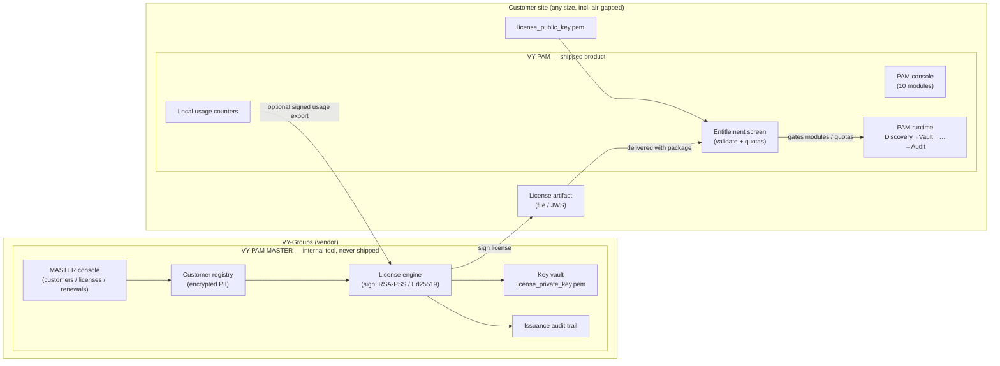
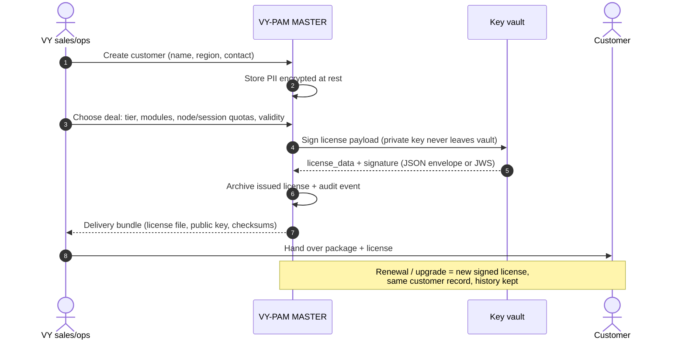
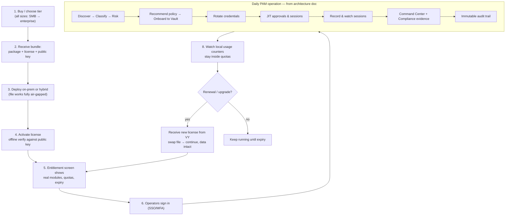
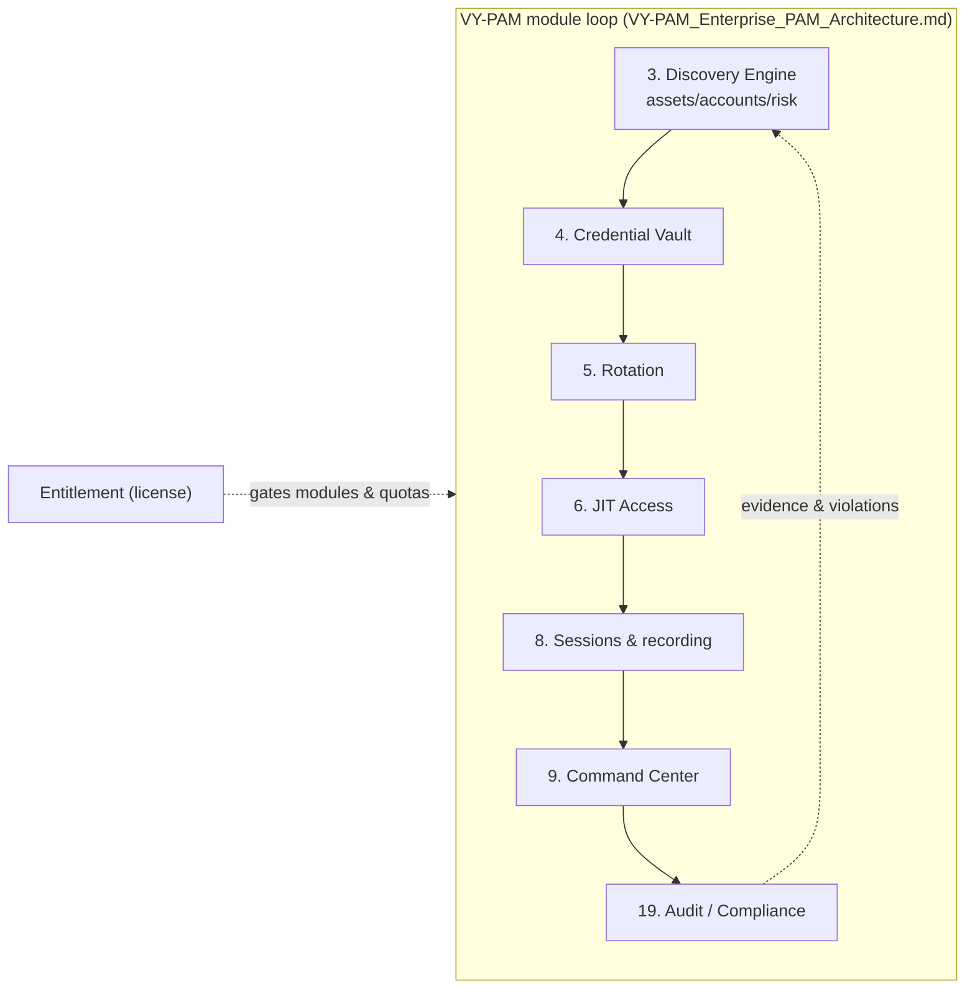

# VY-PAM MASTER + VY-PAM — Product Split, Plan & Workflows

> Companion to `VY-PAM_Enterprise_PAM_Architecture.md` (which remains the
> authoritative requirements for the **PAM product itself** — the "last goal").
> This document defines the **commercial split**: two tools, one platform.

---

## 1. The two products

| | **VY-PAM MASTER** (vendor tool) | **VY-PAM** (shipped product) |
|---|---|---|
| Runs at | VY-Groups only, never shipped | Customer site (on-prem / hybrid / air-gapped) |
| Purpose | Run the business: customers, deals, **license generation**, entitlement catalog, renewals | Operate PAM: discovery → vault → rotation → JIT → sessions → command → audit |
| Data | Customer registry, contacts, quotes, issued-license archive, usage archives (encrypted at rest) | That customer's own assets/accounts/sessions/audit only |
| Keys | **Holds `license_private_key.pem`** — custody never leaves it | Only `license_public_key.pem` for offline verification |
| Issues licenses? | ✅ Yes — its only way to create them | ❌ Never |
| Validates licenses? | Creates + signs | ✅ Offline verify of its own license |
| Audience | Sales / ops staff (internal) | Security & infra teams (customers of every size) |

**Rule of thumb:** if a screen shows *other customers* or *issues a license*,
it belongs to PAM-MASTER. If it shows *infrastructure being protected*, it
belongs to VY-PAM.

---

## 2. Architecture — components & artifacts



Deliverable bundle to a customer = **package + license file + public key +
docs**. Nothing else crosses the boundary.

---

## 3. Vendor workflow — you as the sales/ops side (PAM-MASTER)



---

## 4. Customer journey — you as the customer (VY-PAM)



**What the customer never sees:** license issuing, private keys, the customer
registry, or any other customer's data.

---

## 5. License activation & lifecycle (sequence)

```mermaid
sequenceDiagram
    autonumber
    actor Admin as Customer admin
    participant P as VY-PAM console
    participant V as PAM verify module
    participant F as license file (offline)

    Admin->>P: Import license file (or JWS)
    P->>V: verify(license_data, signature, public key)
    alt signature / expiry / tamper invalid
        V-->>P: reject + honest error
        P-->>Admin: entitlements locked, modules gated off
    else valid
        V-->>P: tiers, modules, quotas, expiry
        P-->>Admin: Entitlement screen: what you own, what is used
    end
    Note over P,F: Fully offline — no callback to VY required.<br/>Usage counters stay local; optional signed export for VY.
```

---

## 6. PAM internal operating workflow (the shipped product = architecture doc)



---

## 7. Phase-wise plan (resumable — checkpoints survive interruptions)

**Working decisions (confirmed):** PAM-MASTER starts as `pam_master/` in this
repo (own app, own API spec, own tests), designed to extract into its own
repo later. Docker is **development-only** (local DB/test environments); the
shipped product installs directly on customer systems — no VM or Docker
required. `backend/ipam_licensing` stays the shared crypto engine (MASTER
signs with it, PAM verifies with it).

> **RESUME RULE:** after any interruption, read the checkpoint below, verify
> it with the listed command, and continue from the first ☐. Never redo a ✅
> phase; re-run its verification instead.

### Phase 1 — Discovery Engine (module 3 of the architecture doc)
- ☑ **1a** Backend: models (`discovered_assets/accounts/scans/events`), rules
  v1 (`BASE_RISK`, `RECOMMENDED_POLICY`, secret-type map, account taxonomy)
  in `backend/phase2_license_server/models.py`
- ☑ **1b** Service: real TCP-connect scanner + banner grab, classify, scope
  caps (256 hosts/24 ports, single-flight), onboard/adopt/patch/stats/lists,
  discovery events merged into `/api/v1/events` — `service.py`
- ☑ **1c** Routes + `apis/openapi.yaml` (8 operations, schemas, events enum,
  admin security) + contract test ADMIN_OPERATIONS — **verify:** `python -m pytest
  backend/phase2_license_server/tests/test_openapi_contract.py -q`
- ☑ **1d** Tests `tests/test_discovery.py` (19, incl. real listener scan) —
  **verify:** `python -m pytest backend -q` → 206 passed
- ☑ **1e** Live smoke (recreated) — **verify:** `python
  %LOCALAPPDATA%\Temp\opencode\smoke_restructure.py` → 17/17
- ☑ **1f** Plan doc `VY-PAM_MASTER_and_PAM_Workflow.md` (this file) +
  phase/checkpoint structure
- ☑ **1g** Wire screen `frontend/screens/target_infrastructure_connectors/`:
  honest static purge (tiles/pills/tabs/rows/probe-stream/mesh/discovery-panel)
  + real JS wiring (stats, assets, filters, search, pagination, scan modal,
  onboard modal, adopt/ignore, event feed) + honest toasts — plus suite-wide
  shared-chrome purge (sidebar ZSP card ×11, top header ×12: breadcrumb /
  attestation / audit-rate / notifications / identity, local logo asset ×11)
- ☑ **1h** Verify screen: `node --check` scripts, fake-data sweep HTTP +
  `file://` in `shots_tool/__verify_discovery.mjs` (58 checks: register,
  real scan, ignore/restore, adopt, probe, filters, feed) +
  `shots_tool/__verify_live.mjs` (28 checks across 4 API screens),
  screenshots recaptured via `shots_tool/__shots.mjs`, launcher badge → LIVE —
  **verify:** `python -m pytest backend -q` → 206 + smoke 17/17 + both node
  verifiers ALL CHECKS PASSED
- ☑ **1i** Commit + push (ephemeral token, verify not persisted) — `9f83bd3`
  pushed to `main`; no `ghp_` in git config, worktree, or history

### Phase 2 — VY-PAM MASTER (vendor tool, `pam_master/`)
- ☑ **2a** Skeleton: own Flask app + config (private key custody lives ONLY
  here), own test fixtures, dev Docker compose (dev-only) — **done:**
  `pam_master/` package (config, custody keys, licensing bridge, health,
  keygen CLI), 13-test suite (temp keys/db only), Dockerfile + compose,
  README with custody rules; live boot smoke honest (`rsa_key: present`,
  `ed25519_key: missing`, `ready: false` = this machine's real state)
  — **verify:** `python -m pytest pam_master -q` → 13 passed
- ☑ **2b** Customer registry: records with PII encrypted at rest, list/create/
  edit, issuance history — **done:** `registry.py` CRUD + validation,
  `crypto.py` AES-256-GCM bound to row `public_id`, `db.py` schema
  (customers + issuance_history), registry key custody (file/b64 env, honest
  503 without it), history write helper for 2c; README API table
  — **verify:** `python -m pytest pam_master -q` → 28 passed
- ☑ **2c** License generation: tier/modules/quotas/validity form → sign via
  `backend/ipam_licensing` → archive + audit trail + delivery bundle export
  (license file + public key + checksums); renewal/replace flow — **done:**
  `issuance.py` (options/issue/renew/list/get/bundle/audit), claims +
  signature via shared engine, encrypted archive (AAD = license_id),
  atomic license+history+audit write, renewal supersedes in-transaction,
  bundle verifies offline (SHA256SUMS + public key inside), shared
  `errors.py` failure types (400/404/409/500/503)
  — **verify:** `python -m pytest pam_master -q` → 40 passed
- ☑ **2d** Own `openapi.yaml` + contract tests; anti-mixing tests (no PAM
  runtime imports; private key absent from shipped surface) — **done:**
  `pam_master/openapi.yaml` (14 operations, strict request bodies, honest
  error-type enum, all response schemas), `tests/test_openapi_contract.py`
  (both-direction path coverage, live-shape checks, enums/ranges mirrored
  against code constants, git-tracked-file private-key scan), anti-mixing
  scan extended (`phase2_license_server` + `from backend.` / `import backend`)
  — **verify:** `python -m pytest pam_master -q` → 46 passed
- ☑ **2e** Docs + screenshots + commit/push — **done:** root README documents
  the two-product split (intro, tree entry, quick-start, custody bullet,
  test counts corrected to 206/46); `pam_master/README.md` complete
  (endpoints, custody rules, API contract). Screenshots: **none apply** —
  the MASTER is API-only, no UI exists in Phase 2 (console/screens
  screenshots return with the shipped side in 3c)
  — **verify (phase boundary):** `pytest backend` 206 + `pytest pam_master`
  46 + smoke 17/17 + both shots verifiers `ALL CHECKS PASSED`

### Phase 3 — Decouple the shipped PAM surface
- ☑ **3a** Self-issue removed from the shipped server: `POST /api/v1/licenses`
  is gone — the server only **verifies and records**, through the new
  `POST /api/v1/licenses/import` (admin token; 400 for malformed / foreign-key
  signed / expired / structurally invalid claims — the old issuing-form rules
  ported to claim-shape checks, claims stored byte-for-byte as signed, never
  normalised; 409 `Conflict` for an already-installed file). `service.issue_license`
  + its `_coerce_*` form helpers deleted, so **no shipped-server code touches a
  private key anymore**. Per decisions: revoke/restore + list/detail **stay** on
  PAM (local revocation-list authority for offline validation + the console's
  entitlement view); issuing/customer lookup live only in PAM-MASTER (2c).
  New `imported` event type (replaces `issued` in event assertions). Tests play
  the vendor: helpers sign with the shared engine then import.
- ☑ **3b** Re-scope `apis/openapi.yaml` + contract + tests — executed in
  lockstep with 3a (the two-directional contract test forbids an unserved
  documented route and an undocumented served one, so route removal, spec and
  test rewrites land together): POST `/licenses` → POST `/licenses/import`,
  `IssueLicenseRequest/Response` → `LicenseEnvelope` request +
  `ImportLicenseResponse`, new `Conflict` response, algorithm enums corrected
  to the real casing (`RSA-PSS-SHA256`/`Ed25519`), `ADMIN_OPERATIONS` updated;
  old form-validation tests rewritten as import rejection tests (+409, expired,
  foreign-signature, unusable-file cases), smoke reworked to sign vendor-side
  and import — **verify (phase boundary):** pytest backend **216** +
  pytest pam_master 46 + smoke 17/17 + both shots verifiers `ALL CHECKS PASSED`
- ☑ **3c** Docs/screens/launcher reflect the split — console rework: the
  `Renew / Upgrade Tier` issue form became `Import Vendor License` (file or
  paste → `POST /licenses/import`, signature verified, claims recorded as
  signed, re-download; `issue*` ids/JS renamed to `import*`); all issuing copy
  → import copy (subtitle, empty states, token note, account note, badge);
  launcher lines fixed; phase-2 server README re-scoped (intro, endpoint row,
  `### Issue` curl section → `### Import`, config notes, audit bullet, test
  counts 134/216); `apis/README` error list +409; frontend README checked —
  already accurate; license `screen.png` recaptured; stale :5000 dev server
  restarted on current code (`POST /licenses` → 405, `/licenses/import` → 400
  on empty body, discovery still honest); live UI check: modal opens, server
  refuses a malformed payload, dev registry untouched, no page errors —
  **verify (phase boundary):** pytest backend **216** + pytest pam_master
  **46** + smoke 17/17 + both shots verifiers `ALL CHECKS PASSED`

### Phase 4 — Continue `VY-PAM_Enterprise_PAM_Architecture.md` (the last goal)
- ☐ **4a** Rotation (5) → ☐ **4b** JIT (6) → ☐ **4c** Sessions (8) →
  ☐ **4d** Command Center hardening (9) → ☐ **4e** Audit (19) → …
  module order per the architecture doc; each module = model + endpoints +
  openapi + tests + honest screen wiring, then commit/push.

### Checkpoint log (update at every phase boundary)
| Date | Stopped after | Resume from |
|---|---|---|
| 2026-10-06 | 1a–1f ✅ (206 tests, 17/17 smoke, plan doc) | **1g** (screen wiring) |
| 2026-10-06 | 1a–1h ✅ (206 tests, 17/17 smoke, 58+58 UI checks, 12 screenshots, launcher LIVE) | **1i** (commit + push) |
| 2026-10-06 | **Phase 1 complete ✅** (`9f83bd3` pushed: Discovery module + honest screen + chrome purge + shots_tool) | **Phase 2 / 2a** (`pam_master/` skeleton) |
| 2026-10-07 | **Phase 2a ✅** (`pam_master/` skeleton: 13 tests, live smoke honest; regression 206 + 17/17) | **2b** (customer registry, PII encrypted at rest) |
| 2026-10-07 | **Phase 2b ✅** (registry CRUD + PII AES-256-GCM at rest; 28 tests; live smoke: 201/list/PATCH/history + no plaintext in DB file) | **2c** (license generation + delivery bundle) |
| 2026-10-07 | **Phase 2c ✅** (issuance: signed claims, encrypted archive, renewal supersedes, offline-verifiable bundle, audit; 40 tests; live smoke: exact 90d/365d spans, sha256 match, tables 0→4) | **2d** (own `openapi.yaml` + contract/anti-mixing tests) |
| 2026-10-07 | **Phase 2d ✅** (own `openapi.yaml` + contract both ways + live shapes + enum mirrors + tracked-key scan + extended anti-mixing; 46 tests) | **2e** (docs + phase close + commit/push) |
| 2026-10-07 | **Phase 2 complete ✅** (PAM-MASTER vendor tool: key custody, PII-encrypted registry, signed issuance/renewal/bundle/audit, own contract — 46 tests; root README split docs; full boundary regression green) | **Phase 3** (decouple shipped PAM surface — **3a**) |
| 2026-10-07 | **Phase 3a+3b ✅** (self-issue removed → vendor-signed `POST /licenses/import`; form rules → claim-shape checks; no server code signs anymore; openapi/contract/tests/smoke lockstep; backend 216, pam_master 46, smoke 17/17, verifiers green) | **3c** (docs/screens/launcher reflect the split) |
| 2026-10-07 | **Phase 3 complete ✅** (console ISSUE → vendor-import flow; launcher + phase-2/apis docs honest; screen recaptured; dev server restarted on current code; backend **216**, pam_master **46**, smoke 17/17, verifiers green, live UI check: modal/error path + registry untouched) | **Phase 4 / 4a** (Rotation (5)) |

---

## 8. Commercial fit — all customer types

- **SMB:** file license, defaults on, single site — same product, fewer nodes.
- **Enterprise:** quotas per node/session, SSO/HSM, multi-site.
- **Air-gapped / regulated:** everything offline by design (file license, no
  phone-home; optional signed usage export transferred manually).
- **Upgrades:** new signed license, same artifact format — no reinstall.
